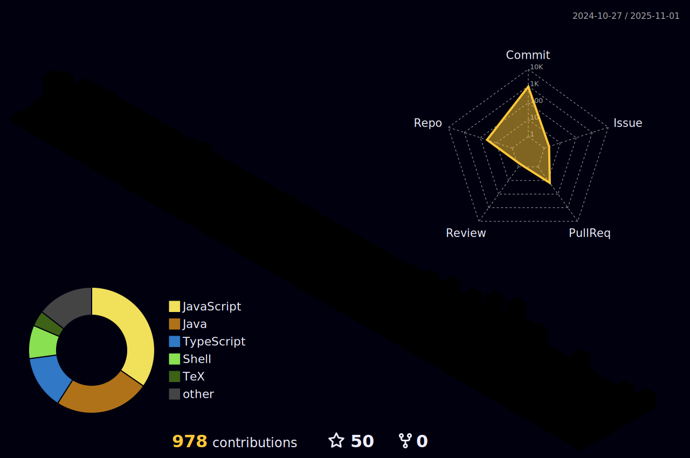

<!---->
<div align="center">

# 🌟 Anurag Kumar 🌟

### DevOps Wizard • Cloud Sorcerer • Code Alchemist


[](https://github.com/Anurag-xo)

<!-- 
Note: The snake animation is generated by a GitHub Action. 
If it's not displaying, you may need to run the "Generate Snake Animation" workflow from the Actions tab of your repository.
-->
<picture>
  <source media="(prefers-color-scheme: dark)" srcset="./assets/github-contribution-snake-dark.svg" />
  <source media="(prefers-color-scheme: light)" srcset="./assets/github-contribution-snake.svg" />
  
</picture>

[](https://spotify-github-profile.vercel.app/api/view?uid=31k6rlp4bm2dceiz5k6u5wp5l43m&redirect=true)

</div>


---

## 🧙‍♂️ Code Wizardry Profile

```javascript
const anurag = {
  pronouns: "He/Him",
  location: "India 🇮🇳",
  currentRole: "Senior DevOps Engineer",
  superpowers: [
    "Kubernetes Cluster Whispering",
    "CI/CD Pipeline Optimization",
    "Cloud Cost Alchemy",
    "Production Incident Telepathy",
  ],
  architecture: [
    "Microservices",
    "Serverless",
    "Event-Driven",
    "Zero-Trust Security",
  ],
  currentQuest: "Building self-healing cloud systems",
  funFact:
    "Rebooted a production server with 300k+ users during an outage... with no downtime",
};
```

---

## 🛠️ Technical Arsenal

<div align="center">
☁️ Cloud & Infrastructure

💻 Development

🔮 DevOps Magic

</div>

---

## 📊 GitHub Analytics

<div align="center">
 

 

</div>

---

## 🏆 Achievements

<div align="center">


</div>

---

## 🚀 Featured Projects

<table> 
<tr> 
<td width="50%"> 
<h3>🤖 Sign Language AI</h3> 
<p>Real-time gesture recognition with 95% accuracy</p> 
<a href="https://github.com/Anurag-xo/sign-language-detection"> 
 
</a> 
</td> 
<td width="50%"> 
<h3>📝 Blog Platform</h3> 
<p>Full-stack app with automated CI/CD pipelines</p> 
<a href="https://github.com/Anurag-xo/Blog-web"> 
 
</a> 
</td> 
</tr> 
<tr> 
<td width="50%"> 
<h3>☁️ K8s Cluster Manager</h3> 
<p>Automated Kubernetes orchestration system</p> 
</td> 
<td width="50%"> 
<h3>🔐 Security Toolkit</h3> 
<p>Pentesting automation framework</p> 
</td> 
</tr> 
</table>

---

## 🎧 Coding Soundtrack

<div align="center">

</div>

---

## 💬 Tech Philosophy

> "The best error message is the one that never shows up, the best logging is the one you never need to check, and the best infrastructure is the one that scales without asking."
>
> -- Cloud Native Manifesto

---

## 🌐 Connect With Me

<div align="center">
<a href="https://www.linkedin.com/in/anurag-kumar-b1a790249/">

</a>
<a href="https://twitter.com/anuragxo1221">

</a>
<a href="mailto:anuragrko42004@gmail.com">

</a>
<a href="https://notrlyanurag.duckdns.org">

</a>
</div>

---

<div align="center">


> "Commit often, perfect later, publish once."

⭐️ From Anurag Kumar
Last Updated: August 1, 2025
</div>```
